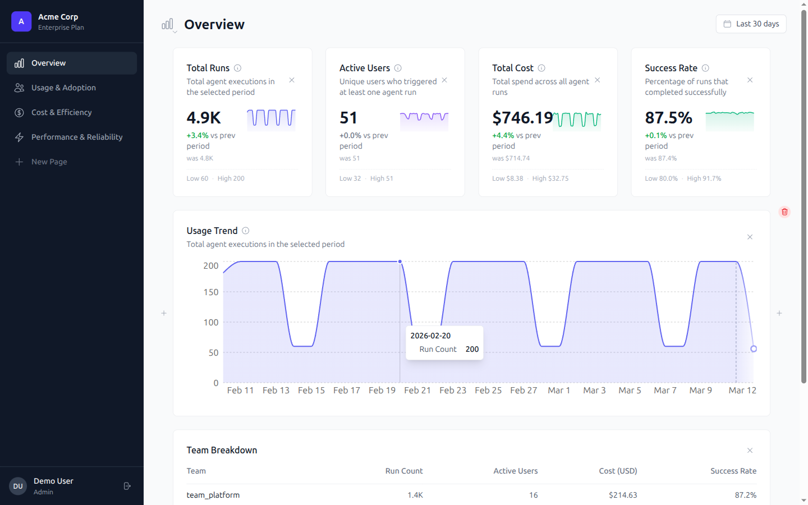
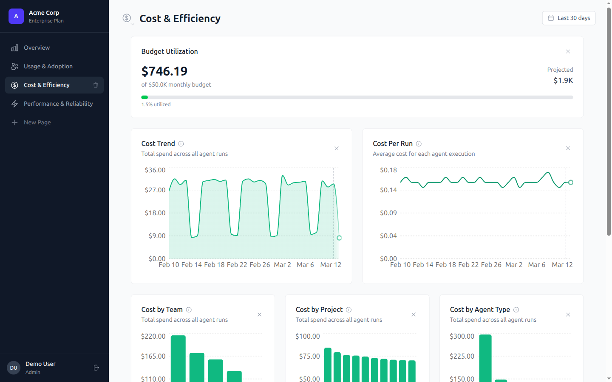
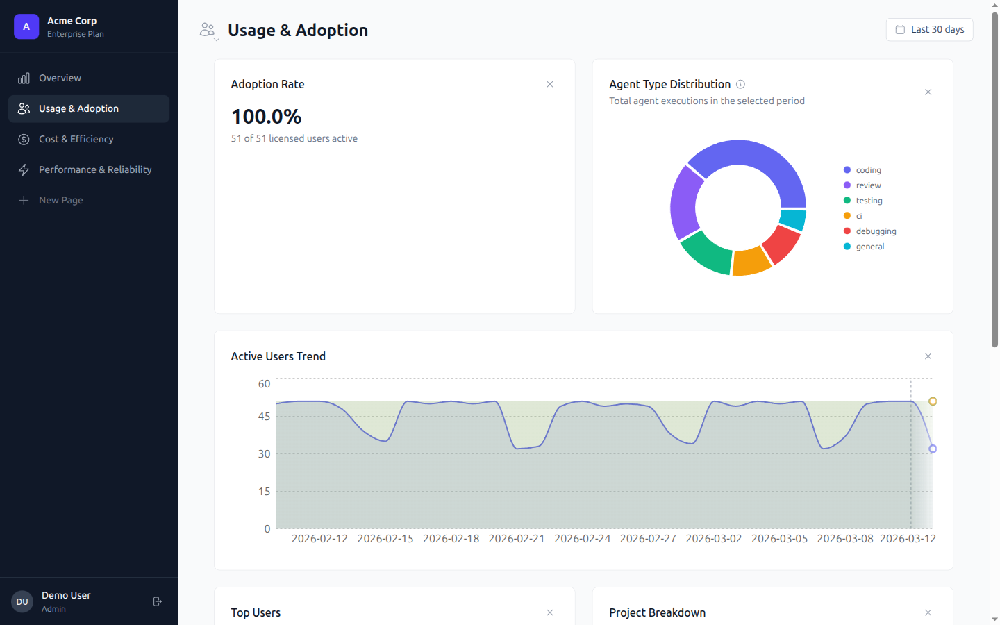
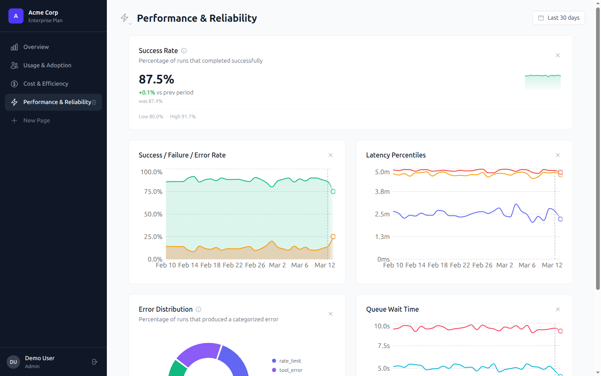
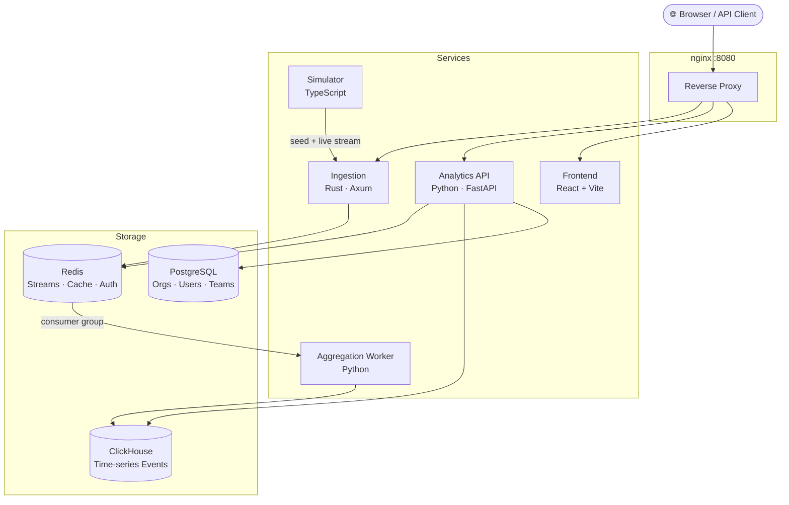

# AgentHub Analytics

[](https://github.com/pablotunon/agenthub-analytics/actions/workflows/ci.yml)


Organizational analytics dashboard for monitoring AI agent usage, cost, and performance across engineering teams. Features multi-tenant authentication, customizable dashboards with user-defined widgets, and real-time event processing.

## Screenshots

| Overview | Cost & Efficiency |
|----------|-------------------|
|  |  |

| Usage & Adoption | Performance & Reliability |
|------------------|---------------------------|
|  |  |

## Architecture



### Services

| Service | Language | Purpose |
|---------|----------|---------|
| **Frontend** | TypeScript (React + Vite) | Dashboard SPA with custom page builder, customizable widgets, Tremor charts, shadcn/ui |
| **Analytics API** | Python (FastAPI) | BFF with JWT auth, serves aggregated metrics from ClickHouse/PostgreSQL/Redis |
| **Ingestion** | Rust (Axum) | High-throughput event intake with org validation, publishes to Redis Streams |
| **Aggregation Worker** | Python | Consumes events from Redis, inserts into ClickHouse, computes aggregations |
| **Simulator** | TypeScript (Node.js) | Seeds multi-org demo data, generates 90 days of historical events + live stream |

### Infrastructure

| Component | Purpose |
|-----------|---------|
| **PostgreSQL** | Organizations, teams, users, projects, API keys |
| **ClickHouse** | Time-series event storage and pre-aggregated analytics |
| **Redis** | Event bus (Streams), real-time counters, API response cache, auth deny-list |
| **nginx** | Reverse proxy routing `/api/*`, `/ingest/*`, and `/` to services |

## Quick Start

```bash
# Assign unique ports for this branch (required on first run)
./scripts/setup-ports.sh

# Start the full stack
docker compose up --build -d

# Wait ~60-90s for the simulator to seed data and backfill events

# Open the dashboard
open http://localhost:8080

# Demo login credentials
# Acme Corp admin:   user@acmecorp.com / pass
# Globex admin:      admin@globexcorporation.com / pass
```

## Key Features

### Authentication & Multi-Tenancy
- JWT-based login with role-based access control (admin, team_lead, viewer)
- Org-scoped data isolation across all services
- Multiple demo organizations (Acme Corp, Globex Corporation)
- Redis deny-list for logout invalidation

### Custom Page Builder
- Customizable widget dashboard with editable pages
- Dynamic row layouts with 1-4 columns per row
- Multiple chart types: Line, Area, Bar, Pie, KPI, Gauge, Table
- Sealed templates for common widget configurations (e.g., Users Trend, Top Users)
- Breakdown dimensions: Team, Project, Agent Type, Error Category, Model

### Metrics & Analytics
- 15+ tracked metrics: run count, active users, cost, success/failure/error rate, latency percentiles (p50/p95/p99), token usage, queue wait times
- Batch widget query endpoint for efficient multi-metric fetches
- Per-metric Redis caching
- Time range picker with preset periods and custom date ranges

### Real-time Event Processing
- High-throughput ingestion via Rust (Axum)
- Org validation on incoming events
- Redis Streams consumer groups for async processing
- ClickHouse pre-aggregated tables for fast analytics queries

## Tech Stack Rationale

- **Rust (Ingestion)** — Zero-cost abstractions for high-throughput event processing; Axum provides async-first HTTP with compile-time safety
- **Python (API + Worker)** — FastAPI for rapid BFF development with auto-generated OpenAPI docs; mature ClickHouse and PostgreSQL client libraries
- **TypeScript (Frontend + Simulator)** — React + Vite for fast iteration; Tremor for analytics-grade charts; TanStack Query for server state management
- **ClickHouse** — Column-oriented engine purpose-built for time-series aggregation at scale
- **Redis Streams** — Lightweight event bus with consumer groups, avoiding the operational complexity of Kafka for this scale

## API Endpoints

All `/api/metrics/*` endpoints accept: `period` (`7d`, `30d`, `90d`), `teams`, `projects`, `agent_types` as query parameters.

| Method | Path | Description |
|--------|------|-------------|
| POST | `/api/auth/login` | Authenticate and receive JWT token |
| POST | `/api/auth/logout` | Invalidate current token |
| GET | `/api/health` | Service health with dependency status |
| GET | `/api/orgs/current` | Current organization with teams and projects |
| GET | `/api/metrics/overview` | KPI cards, usage trend, team breakdown |
| GET | `/api/metrics/usage` | Adoption rate, active users, agent/project breakdown |
| GET | `/api/metrics/cost` | Cost trends, breakdown, token usage, budget |
| GET | `/api/metrics/performance` | Success rate, latency, error breakdown |
| POST | `/api/metrics/widget/batch` | Batch query for multiple widget metrics |
| POST | `/ingest/events` | Ingest event batch (1-100 events) |
| GET | `/ingest/health` | Ingestion service health |

## Development

All commands run inside Docker containers. No local installs (`npm install`, `pip install`, etc.) on the host.

```bash
# Port setup (required once per branch for multi-branch dev)
./scripts/setup-ports.sh

# Rebuild a single service
docker compose up --build -d <service_name>

# Run all tests / single service / E2E
./scripts/test.sh
./scripts/test.sh <service_name>
./scripts/test.sh e2e

# Manage npm dependencies without leaving Docker
./scripts/npm.sh frontend install --save-dev <package>

# Stop / full reset
docker compose down
docker compose down -v && docker compose up --build -d
```

## Project Structure

```
.
├── docker-compose.yml        # Full stack orchestration
├── nginx/nginx.conf          # Reverse proxy configuration
├── scripts/
│   ├── setup-ports.sh        # Branch-specific port assignment
│   ├── test.sh               # Unified test runner
│   └── npm.sh                # Dockerized npm operations
├── frontend/                 # React + Vite + Tailwind + Tremor
├── analytics-api/            # FastAPI BFF with auth
├── ingestion/                # Rust Axum service
├── aggregation-worker/       # Python event consumer
├── simulator/                # TypeScript data generator
├── init-scripts/             # PostgreSQL and ClickHouse schemas
└── tests/e2e/                # Playwright E2E tests
```
